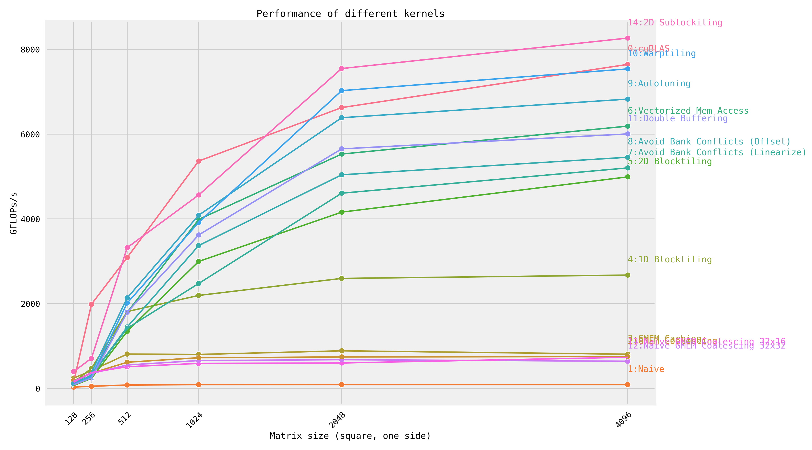

# Fast CUDA SGEMM from Scratch

Step-by-step optimization of matrix multiplication, implemented in CUDA.
For an explanation of each kernel, see [siboehm.com/CUDA-MMM](https://siboehm.com/articles/22/CUDA-MMM).

## Overview

Running the kernels on a NVIDIA RTX 3070 Ti Mobile (Ampere)

Clocks [locked to base values](https://salykova.github.io/sgemm-gpu) for profiling:

   - nvidia-smi --lock-gpu-clocks=1035
   - nvidia-smi --lock-memory-clocks=7001



GFLOPs at matrix size 4096x4096:
<!-- benchmark_results -->
| Kernel                              |   GFLOPs/s | Performance relative to cuBLAS   |
|:------------------------------------|-----------:|:---------------------------------|
| 1: Naive                            |       89   | 1.2%                             |
| 12: Naive GMEM Coalescing 32x32     |      640.2 | 8.4%                             |
| 13: Naive GMEM Coalescing 32x16     |      734.1 | 9.6%                             |
| 2: GMEM Coalescing                  |      751.8 | 9.8%                             |
| 3: SMEM Caching                     |      806.6 | 10.6%                            |
| 4: 1D Blocktiling                   |     2673.8 | 35.0%                            |
| 5: 2D Blocktiling                   |     4991.2 | 65.3%                            |
| 7: Avoid Bank Conflicts (Linearize) |     5202.9 | 68.1%                            |
| 8: Avoid Bank Conflicts (Offset)    |     5454.2 | 71.3%                            |
| 11: Double Buffering                |     6004.5 | 78.5%                            |
| 6: Vectorized Mem Access            |     6188.8 | 80.9%                            |
| 9: Autotuning                       |     6826.4 | 89.3%                            |
| 10: Warptiling                      |     7539.4 | 98.6%                            |
| 0: cuBLAS                           |     7645.4 | 100.0%                           |
| 14: 2D Sublockiling                 |     8266.9 | 108.1%                           |
<!-- benchmark_results -->

## Setup

1. Install dependencies: CUDA toolkit 12, Python (+ Seaborn), CMake, Ninja. See [environment.yml](environment.yml).
1. Configure NVCC compilation parameters. Look up your GPUs compute
   capability [here](https://developer.nvidia.com/cuda-gpus). Then configure the `CMakeLists.txt` and change:
    ```cmake
    set(CUDA_COMPUTE_CAPABILITY 80)
    ```
1. Build: `mkdir build && cd build && cmake .. && cmake --build .`
1. Run one of the kernels: `DEVICE=<device_id> ./sgemm <kernel number>`
1. Profiling via [NVIDIA Nsight Compute](https://developer.nvidia.com/nsight-compute) (ncu): `make profile KERNEL=<kernel number>`

Credit goes to [wangzyon/NVIDIA_SGEMM_PRACTICE](https://github.com/wangzyon/NVIDIA_SGEMM_PRACTICE) for the benchmarking setup.